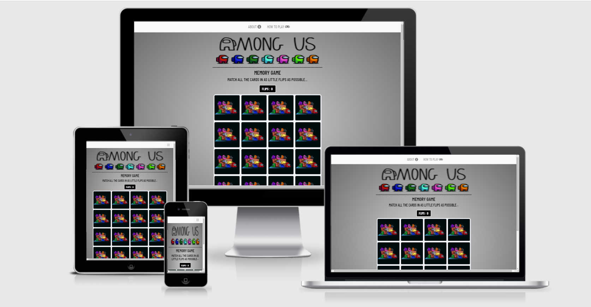
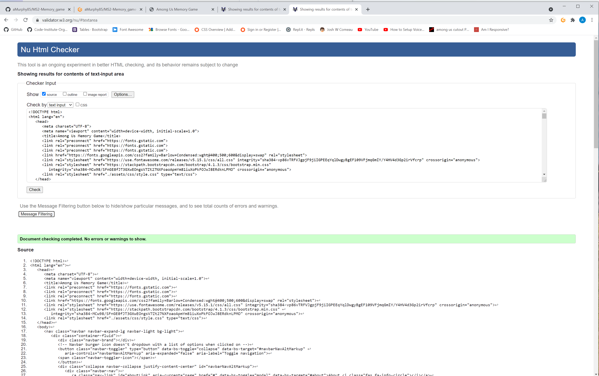
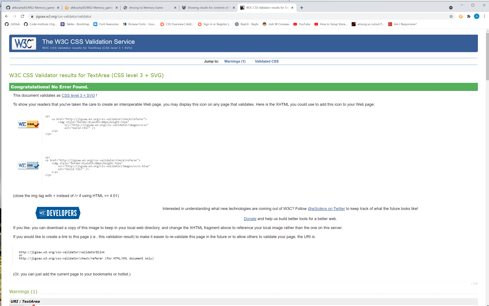
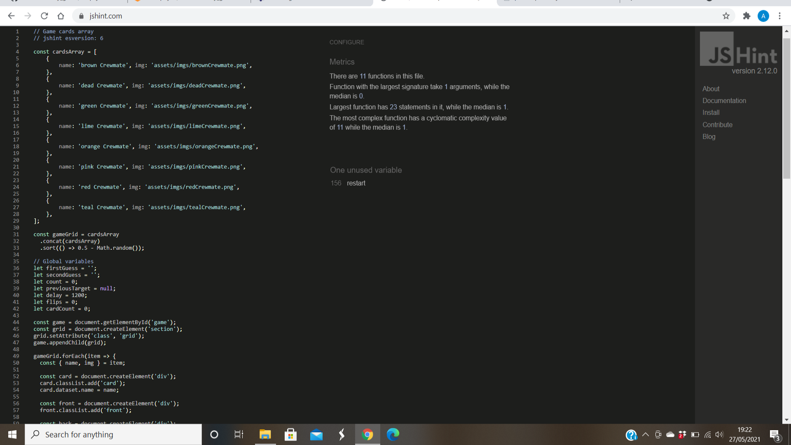
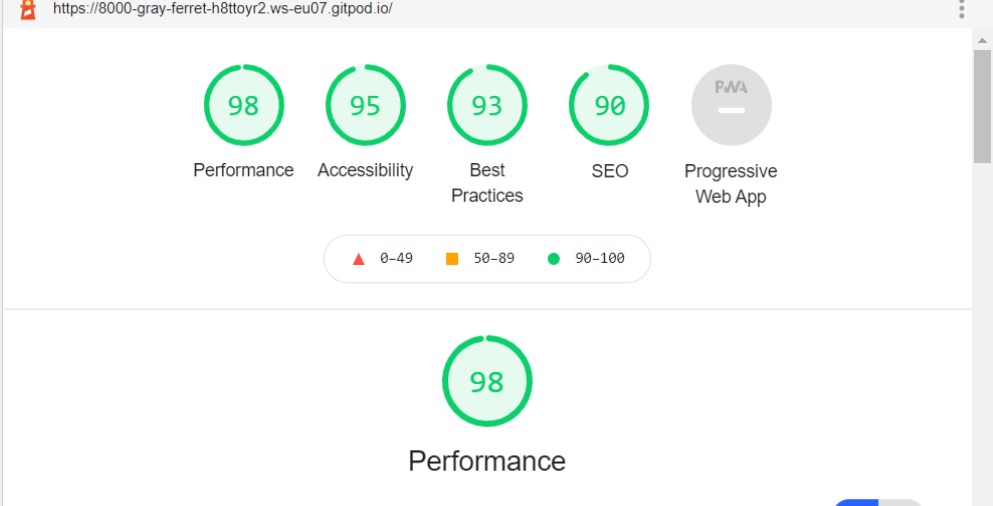
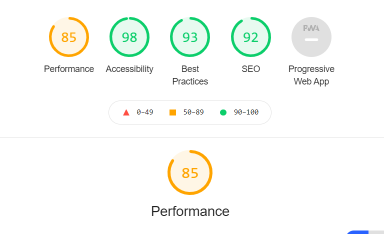

# _Among Us Memory Game_
- A simple memory game based on the hugely popular online murder mystery game (Among Us), set on a space station.
- The main objective of the game is to match all the pairs of cards in as few flips as possible. 
- The webpage has a very simple layout with a header with the games crewmates lined up which users will find amusing, a simple grid layout for the cards, a flip counter, and a restart button, all with a faded backdrop to emulate an outer space feel.
- Great images of various crewmates carrying out various tasks have been used for the cards, which are bright and eye-catching to users.
- Simple instructions make it clear what users have to do without overwhelming them with too much information on load up.

# _UX_
- This website was created for users who are fans of the gaming world, particularly the among us game who are just looking to
pass the time with a fun game.

## _User Stories_
- _A user to this website:_
- I want to navigate through the site easily.
- I want simple instructions on the rules of the game.
- I want eye-catching images and design layout on any device.
- I want to test my memory skills while at the same time having a bit of fun.
- I want a game complete notice telling me how many flips I did it in.
- I want motivation to play again and try to better my previous scores.
- I want a restart button so I can start the game over at any time.
- I want to be able to quit the game at any time.

## _Wireframes_

## _Features_
#### _Homepage_
- A background that has a white center point and fades to a darker grey color towards the outskirts of the page.
- A navbar that has links to pop up modals:
    - 1 with detailed information about the Among Us game that is available to play online.
    - And another with a more detailed description of how to play the memory game.
- A header image of the Among Us game title with various crewmate characters acting as a bottom border.
- Clear simple instructions on how to play.
- An interactive flips counter that keeps track of how many cards flips you have had while trying to complete the game.
- A 4 X 4 grid of cards displaying the image of many crewmates hanging out on a sofa playing on electronic devices.
- Game cards that are large enough to be seen clearly, on all devices.
- A restart button underneath the game cards that refreshes the page/flip counter, so users can start over whenever they want.
- A quit button beside the restart button that when pressed has a pop-up indicating how many flips you have had before leaving with
a sorry to so you leave a message.

#### _After matching all the cards_
- A victory pop up with a slight time delay, appears on game completion, that has a message congratulating you and indicates how 
many flips it took you to match all the cards in.
- The victory pop up also has a message enticing players to try and beat their previous flips score followed by a play again button
that restarts the game.

## _Features left to implement_
- A difficulty level (easy, normal, hard, casual with no timer) with fewer or more cards depending on the difficulty selected.
- A count-down timer that has different start points depending on the difficulty level selected for the user to beat before they run out of time.
- A on load up start screen pop-up that holds the game's title, a small introduction on how to play, and a click to start.
- Links to more information on the among us game (ie. Youtube videos of gameplay, twitch players playing the game live, and to steam, where
players can purchase the game if they fancy giving it a go for themselves).
- Audio and visual cues from the game for background theme, correct and incorrect card matches, a victory pop-up indicator, etc, to help make the user
feel more interaction with the site.

## _technologies used_
#### _Languages used_
- HTML5 for page content.
- CSS for page element styling.
- JavaScript for game logic.

#### _Libraries and Frameworks used_
- - [BootStrap](https://getbootstrap.com/docs/4.1/content/tables/)
    - **Bootstrap classes** to make elements responsive to different screen devices.
- - [Font_awesome](https://fontawesome.com/)
    - **Font awesome icons** to decorate the text.
- - [Google_fonts](https://fonts.google.com/)
    - **Google fonts** for the font used in the webpage.
- - [Balsamiq_Wireframes](https://balsamiq.com/wireframes/?gclid=CjwKCAjw47eFBhA9EiwAy8kzNIzUJovs67fX-HxfKaqbrJD7TjNN_URl15EZ4nMv_BDX0TkEIpQg_xoCdLMQAvD_BwE)
    - **Balsamiq wireframes** to create mockups of what the site will look like.

#### _Tools and Other resources used_
- GitHub to deploy webpage
- GitPod to build a webpage
- W3Schools for help with my HTML, CSS, and JavaScript
- CityPNG for the images used in the website
- W3C HTML and CSS validator to check
- Autoprixer CSS online

#### _Code used_
- [Tania_Rascia](https://www.taniarascia.com/how-to-create-a-memory-game-super-mario-with-plain-javascript/)
    - **Tania_Rascia** followed instructions to create memory game template.
- [Among_Us_Wikipedia](https://en.wikipedia.org/wiki/Among_Us)
    - Taken snippet of code to use in the "About" pop up window.

## _Testing_
### _User stories testing_
- As a user of this Among Us Memory Game website I:

    - I want to understand what the website is about easily.
        - A clear title image followed by a large header explaining it's a memory game.

    - I want a simple design that is easy to navigate.
        - A simple one-page website with elements like the navbar, header, game information,
        main game area and small footer in positions are meant to give a better UX.

    - I want clear simple instructions explaining what it is I am meant to do.
        - A clear title and a simple one-line sentence clearly explaining the game's rules what 
        it is what the user needs to do.

    - I want detailed instructions on what the game is based on and a more descriptive explanation if needed.
        - The navbar provides links to simple pop-ups that explain the Among Us online murder mystery 
        game and a more descriptive step-by-step explanation of the game if needed.

    - I want the flips counter to keep track of how many flips I am taking to complete the game.
        - A clear indicator that counts up every time a user flips a card is identified and easy to see
        while playing the game for users to keep track of.

    - I want the game area to be clear and easy to see.
        - A clear 4 X 4 grid of cards sized large enough with nice spacing between making it clear to users to see. 
        The card's color scheme is a bold darker black against a much brighter white also making it clearer for the users.

    - I want to see interesting good quality images to memorize while playing.
        - Simple good quality colorful images of the Among Us crewmates make the cards easy to identify between 
        that users will also find attractive and amusing while playing.

    - I want to be able to restart the game easily if I need to.
        - A indicated button just below the card grid area can be pressed at any time during the game that brings up 
        a little pop-up box in the middle of the screen that double-checks the user does want to restart and if they do then
        press yes the page refreshes, shuffles the cards again, and resets the flips counter.

    - I want to be able to quit the game easily if I need to.
        - A indicated button just below the card grid area can be pressed at any time during the game that brings up a little pop-up box in the middle of the screen that double-checks the user does want to quit with a sorry to see you leave a message. If they decide they want to leave the yes button refreshes the page.

    - I want a victory pop-up window displaying a congratulation indicating how many moves it took me to find the matches.
        - On completion of finding all the card pairs, a pop-up window displays in the center of the screen congratulating users
        and displaying the number of moves they took to complete the game followed by a little message asking them to try and 
        beat their best score with a play again button that refreshes the page, shuffles the cards, and resets the flips counter.

    - I want to be able to play the game on any device.
        - The website is responsive to all device sizes (desktop, tablet, and phones) maintaining its 4 X 4 game grid with game
        card sizes that are still clear to see.

### _Manual testing_
#### _Desktop_
    - Navbar links:
        - Hover mouse over links, verify that the purple and red text color change affects the appropriate link.
        - Click on both links, verify that the correct pop-up modal comes up in the right location.

    - Navbar:
        - Scroll down the page, verify the navbar is not fixed to the top of the page at all times.

    - Title image:
        - Check the size and position fits the design and layout of the page.

    - Header & Instructions:
        - Verify the positioning is central, correct sizing for users to see clearly.
    
    - Flips counter:
        - Verify the counter is positioned central is sized correctly for users to see clearly.

    - Game area/cards:
        - Verify game grid is central and fits the design of the page and clear for users to see.
        - Verify the cards are sized well and spaced evenly apart creating a smoother UX.
        - Verify the card images are clear for users to see.
        - Hover over the cards, verify the bright cyan border is working making it clear to the user what card they are on.
        - Click on the game cards, verify that the cards are rotating, and displaying the crewmate images for users to match.
        - Click on the same card, verify that the turned-over card can't be clicked on again and simulate a 
        match.
        - Click on 2 cards, verify that a third card can't be selected.
        - Cards match, verify that when 2 cards that have been turned over match that they disappear so they can't be selected again.
        - cards do not match, verify that when 2 cards that have been turned over do not match that they flip back over to the original state.

    - Restart and Quit buttons:
        - Verify that the 2 buttons are sized equally and spaced evenly apart.
        - Hover on, verify that the background and text color change within the buttons.
        - Click on the buttons, verify that the appropriate pop-up modal shows with the correct content,
        and is positioned correctly.
        - Click on the modal buttons, verify that they perform the correct tasks:
            - restart modal 'No', close the modal window and continue playing the game.
            - restart modal 'Yes', refresh the page, shuffle the cards, and resets the flip counter.
            - quit modal 'Stay', closes the modal window, and continue playing the game.
            - quit modal 'Leave', refresh the page, shuffle the cards, and resets the flips counter.

    - Victory pop up window:
        - Match all the cards and complete the game, verify that the victory pop up window shows after
        the correct delay and is positioned correctly so that users can see it easily.
        - Verify that the content within the modal is correct and shows the number of flips the user 
        made to complete the game.
        - Play again button, verify that the button refreshes the page, shuffles the cards, and resets 
        flips counter ready for users to play again.

#### _Tablet & Mobile devices_
    - Navbar toggler icon:
        - Verify that the burger icon shows up on smaller screen devices instead of the navbar links.
        - Verify that when the burger icon is clicked on the dropdown menu works and reveals the links inside.
        - Verify that when the navbar links have been clicked on that the appropriate modal displaying the correct content pops up.

    - Navbar:
        - Scroll down the page, verify the navbar is not fixed to the top of the page at all times.

    - Title image:
        - Check the size and position still fits the design and layout of the page.
    
    - Header & Instructions:
        - Verify the positioning is central, still a good size for users to see clearly.

    - Flips counter:
        - Verify the counter is positioned central, and still sized so that the users can still see it.

    - Game area/cards:
        - Verify game grid fits the screen size appropriately, maintains the 4X4 grid, and still clear for users to see.
        - Verify the card size changes to fit the screen size, and space evenly apart creating a smoother UX.
        - Verify the card images are still clear to the users to see.
        - Click on the game cards, verify that the cards are rotating, and displaying the crewmate images for users to match.
        - Click on the same card, verify that the turned-over card can't be clicked on again and simulate a 
        match.
        - Click on 2 cards, verify that a third card can't be selected.
        - Cards match, verify that when 2 cards that have been turned over match that they disappear so they can't be selected again.
        - cards do not match, verify that when 2 cards that have been turned over do not match that they flip back over to the original state.

    - Restart and Quit buttons:
        - Verify that the 2 buttons are still sized equally and clear to users.
        - Click on the buttons, verify that the appropriate pop-up modal shows the correct content,
        and fits the screen size correctly.
        - Click on the modal buttons, verify that they perform the correct tasks:
            - restart modal 'No', close the modal window and continue playing the game.
            - restart modal 'Yes', refresh the page, shuffle the cards, and resets the flip counter.
            - quit modal 'Stay', closes the modal window, and continue playing the game.
            - quit modal 'Leave', refresh the page, shuffle the cards, and resets the flips counter.

    - Victory pop up window:
        - Match all the cards and complete the game, verify that the victory pop up window shows after
        the correct delay and fits the screen correctly so that users can see it easily.
        - Verify that the content within the modal is correct and shows the number of flips the user 
        made to complete the game.
        - Play again button, verify that the button refreshes the page, shuffles the cards, and resets 
        flips counter ready for users to play again.

### __HTML validator results__
- Results after running my HTML through the W3 online validator.

### __CSS validator results__
- Results after running my CSS through the W3C online validator.

### __JavaScript validator results__
- Results after running the code through the JShint online code quality tool.

### __Lighthouse results__
- Desktop results.

- Mobile results.

## _Issues I encountered_
- After running my script.js code through the JShint code quality tool and rectifying the issues highlighted I was 
left with only one remaining.
    - "One unused variable, line 156, restart"

- I temporarily removed the restart() function and tried the restart and play again button to check if the website would
refresh and start the game over. The buttons did not refresh the page after the test so decided to leave the code as it was.

- After deploying the website and running the game on my phone I noticed that the cards flip over but the images do not show up.
The game still functions absolutely fine in chrome dev tools on smaller devices.
    - Tried resizing the images and compressing the files, and it didn't work so decided to keep original files as the picture quality
    on desktop was so much better.

## _Deployment_

- This webpage was developed using GitPod, commited and pushed to GitHub.
- To deploy this webpage from it's GitHub repsoitories, the following steps were carried out;
    1. Open GitHub webpage and log in.
    2. From the drop down menu in the top right of the page, click on Your repositories.
    3. From the list of repsoitories click on MS2-Memory_game
    4. From the options above select Settings.
    5. Once in the settings scroll down to find the GitHub pages section.
    6. In the GitHub pages section, click on the Source dropdown menu where it says None and select Master.
    7. After selecting Master, click on Save.
    8. This should refresh the page and now the webpage is now deployed.
    9. In the GitHub pages section the link to the webpage should now be visible.

- To run this site locally.
- To clone this repository from GitHub you'll need to,

    1. Go to GitHub.com
    2. Log in to my account.
    3. Click on repsoitories.
    4. Click on MS2-Memory_game.
    5. Click on the green button marked "clone or download".
    6. Click on the copy icon on the right side of the URL and this copies URL link.
    7. Open repo or create new repo.
    8. Type git clone and paste URL link and press enter.

## _Credits_
#### _HTML_
- HTML was written by myself.
- Content in the about information pop-up window taken from the Among us Wikipedia page and modified by me.
    [Wikipedia_page](https://en.wikipedia.org/wiki/Among_Us)

#### _CSS styling_ 
- [Tania_rascia](https://www.taniarascia.com/how-to-create-a-memory-game-super-mario-with-plain-javascript/)
    - Basic card grid and card rotating styling taking from Tania Rascia and modified by myself.

#### __JavaScript_
- [Tania_rascia](https://www.taniarascia.com/how-to-create-a-memory-game-super-mario-with-plain-javascript/)
    - Followed Tania Rascia instructions to create the game and modified it by myself to add a flips counter and victory popup window.

#### _Images_
- [cityPNG](https://www.citypng.com/photo/4729/red-among-us-character-png)
    - Free to download images of Among us crewmates "Download Among Ug Red Character PNG Free HD and use it as you like for only personal use."

## _Acknowledgments_
- Inspiration for this project was received from:
    - Other code institute students' projects.
    - To create a simple game my 2 young children would enjoy playing.